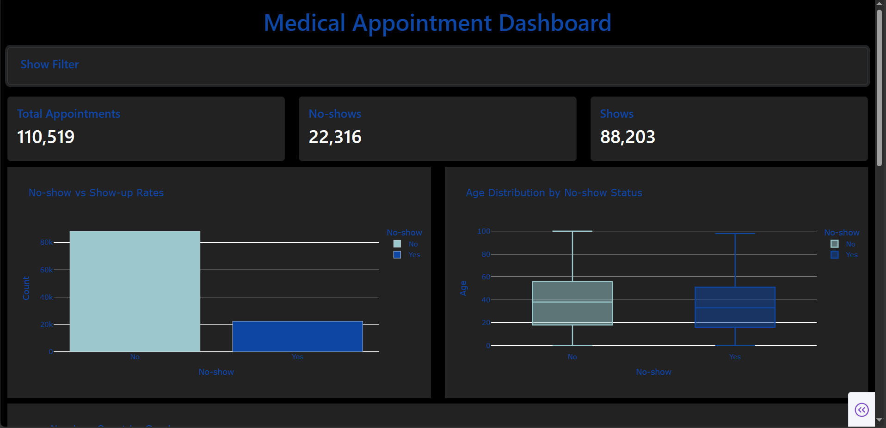

# 🏥 Medical Appointment Dashboard

An **interactive medical appointment analysis dashboard** built with [Plotly Dash](https://dash.plotly.com/) and [Bootstrap](https://dash-bootstrap-components.opensource.faculty.ai/).  
This tool visualizes patient attendance patterns, no-show rates, demographics, and chronic condition impacts.

---

## 📸 Preview


---

## 🚀 Features
- 📊 **Dynamic KPIs** — Total appointments, shows, and no-shows
- 🎛 **Interactive filters** — Filter by gender, age range, and neighborhood
- 📅 **Time trends** — Appointments by weekday
- 🧍 **Demographic insights** — Age & gender distribution
- ❤️ **Health factors** — Impact of chronic conditions
- 🌙 **Dark theme** — Consistent and professional styling

---

## 📂 Project Structure
```
medical-appointment-dashboard/
│
├── app.py # Main dashboard app
├── requirements.txt # Dependencies
├── README.md # Documentation
├── data/ # Dataset storage
└── assets/ # Custom stylesheets/images
```

## 📦 Installation

### 1️⃣ Clone the Repository
```
git clone https://github.com/your-username/medical-appointment-dashboard.git
cd medical-appointment-dashboar
```

### 2️⃣ Create a Virtual Environment
```
python -m venv venv
source venv/bin/activate   # Mac/Linux
venv\Scripts\activate      # Windows
```

### 3️⃣ Install Dependencies
```
pip install -r requirements.txt
```

## ▶️ Usage
```
python app.py
```

### Then open your browser at:

http://127.0.0.1:8050/

## 📊 Dataset

The dataset is publicly available on [Kaggle](https://www.kaggle.com/datasets/joniarroba/noshowappointments).

## 📜 License

This project is licensed under the MIT License — see the LICENSE file for details.
